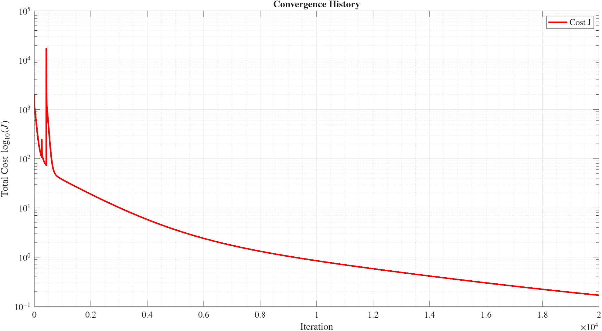
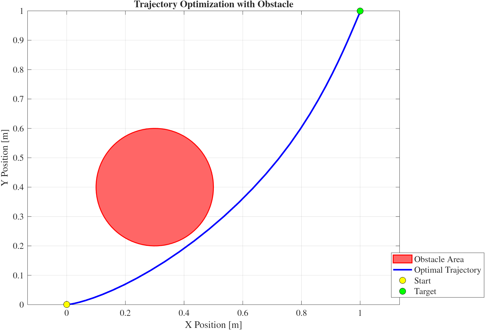

# Nonlinear Optimal Control

## 📌 Problem Statement

This assignment addresses a nonlinear optimal control problem aimed at driving a vehicle from a given initial state to a desired final state within a fixed time horizon.

The objectives are to:
* **Reach a target state** accurately.
* **Reach the final point with null speed**.
* **Reach the final point with null acceleration**.
* **Avoid a circular obstacle region**.

The cost functional is defined as:

$$J = \frac{1}{2} (\mathbf{x}(t_f) - \mathbf{x}_f)^T \mathbf{P} (\mathbf{x}(t_f) - \mathbf{x}_f) + \int_{t_0}^{t_f} L(\mathbf{x},\mathbf{u}) dt$$

With the running cost:
$$L(x,u) = \frac{1}{2} w_1 u_1^2 + \frac{1}{2} w_2 u_2^2 + \beta x_3^2 + \Pi(x_1, x_2)$$

And the obstacle avoidance term:
$$\Pi(x_1, x_2) = \alpha \exp\left(\frac{r^2 - (x_1 - x_c)^2 - (x_2 - y_c)^2}{\sigma}\right)$$

---

## System Dynamics

The robot's motion is governed by the following non-linear dynamics:

$$
\begin{cases}
\dot{x}_1 = x_3 \cos(x_4) \\
\dot{x}_2 = x_3 \sin(x_4) \\
\dot{x}_3 = x_5 \\
\dot{x}_4 = u_2
\dot{x}_5 = \frac{1}{m}(u_1 - 2 C_d x_3 x_5)
\end{cases}
$$

**State vector:**
$$\mathbf{x} = [x_1, x_2, x_3, x_4, x_5]^T = [x, y, v, \phi, a]^T$$

**Control Vector:**
$$\mathbf{u} = [u_1, u_2]^T$$
Where $u_1$ is the derivative of the thrust, while $u_2$ is the action on the angle of the car.

**Boundary Conditions:**
$$\mathbf{x}_0 = [0, 0, 0, 0]^T, \quad \mathbf{x}_f = [1, 1, 0, \pi/3, 0]^T$$

**Time Horizon:**
$$t_0 = 0, \quad t_f = 5$$

**Parameters:**
* Mass: $m = 1$
* Drag coefficient: $C_d = 0.3$
* Obstacle: radius $r = 0.2$, center $(x_c, y_c) = (0.3, 0.4)$

---

## Methodology

### Indirect Method (Forward-Backward Sweep)
Iterative approach based on **Pontryagin’s Maximum Principle (PMP)**.

**Algorithm steps:**
1. Initialize control: $u^{(0)}(t)$
2. Forward integration: $\dot{x} = f(x,u), \quad x(t_0) = x_0$
3. Backward integration: $\dot{\lambda} = -\frac{\partial \mathcal{H}}{\partial x}, \quad \lambda(t_f) = \frac{\partial \Phi}{\partial x}$
4. Optimality condition: $\frac{\partial \mathcal{H}}{\partial u} = 0$
5. Control update: $u^{(i+1)} = u^{(i)} - \tau \frac{\partial \mathcal{H}}{\partial u}$
6. Repeat until convergence: $\left| \frac{\partial \mathcal{H}}{\partial u} \right| \le \epsilon$

**Hamiltonian:**
$$\mathcal{H}(x,u,\lambda) = L(x,u) + \lambda^T f(x,u)$$

## Results

**Weights:**
* $w_1 = w_2 = 0.1$
* $\alpha = 40, \beta = 0.1, \sigma = 0.0001$
* Terminal weight: $\mathbf{P} = \text{diag}(2000, 2000, 1000, 50, 2000)$

### 1. Cost Functional Convergence

### 2. Trajectory Evolution 

---
