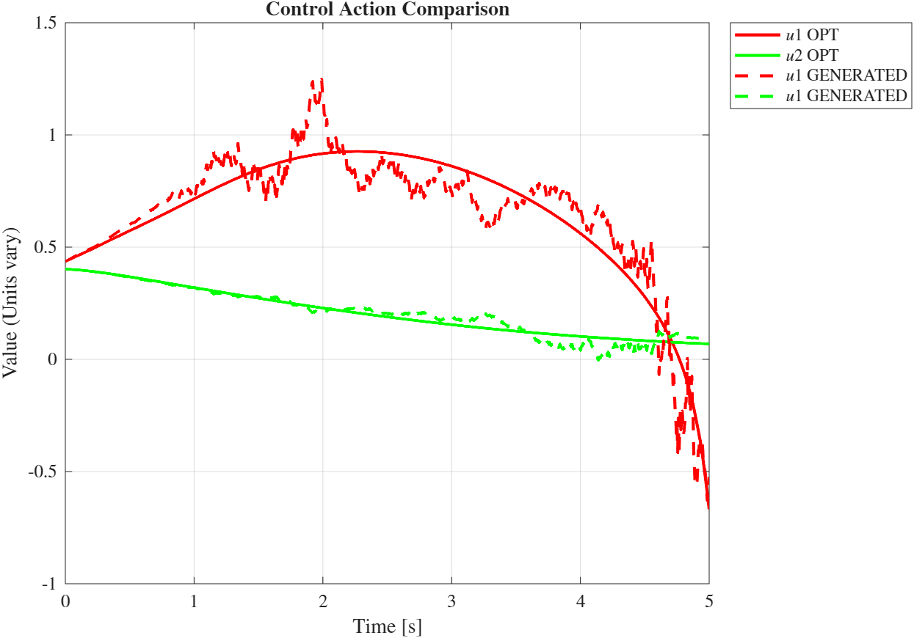
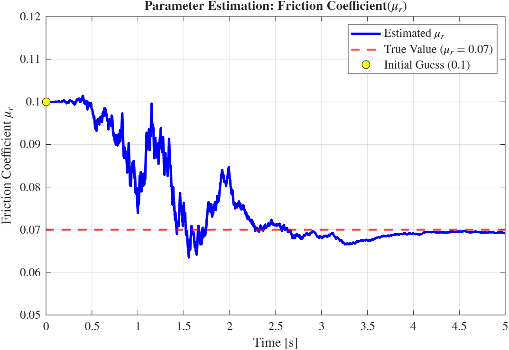
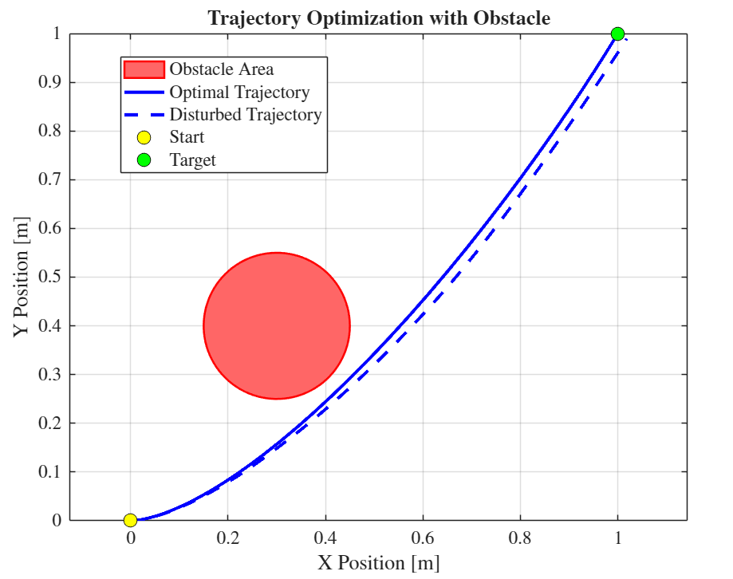

# Optimal Control & State Estimation for Autonomous Systems 🚀

##  Overview

The core objective of this work is to solve complex **Nonlinear Optimal Control Problems (OCP)** and implement robust **State Estimation** for a vehicle with non-holonomic dynamics. In this project concepts like **LQR**, **Extended Kalman Filter**, **Parameter Estimation**, **Optimal Control** are deeply used.

---

## The Physical Model - With the Augmented Dynamics For Parameter Estimation

All assignments share a common non-linear dynamic model representing a vehicle with drag and potential field-based obstacle avoidance:

$$
\begin{cases}
\dot{x}_1 = x_3 \cos(x_4) + w_1 \\
\dot{x}_2 = x_3 \sin(x_4) + w_2 \\
\dot{x}_3 = \frac{1}{m}\left(u_1 - C_d x_3^2 - \mu_r m g \tanh\left(\frac{x_3}{\varepsilon}\right)\right) + w_3 \\
\dot{x}_4 = u_2 + w_4 \\
\dot{x}_5 = w_p
\end{cases}
$$

**State vector:**
$$\mathbf{x}_A = [x_1, x_2, x_3, x_4, x_5]^T = [x, y, v, \phi, \mu_r]^T$$

**Noise Assumptions:**
* Process noise: $\mathbf{w}_A \sim \mathcal{N}(0, \mathbf{Q}_A)$
* Measurement noise: $\mathbf{v} \sim \mathcal{N}(0, \mathbf{R})$

---

## Problem Setup

* **Initial state:** $\mathbf{x}_{i,\text{nom}} = [0, 0, 0, 0]^T$
* **Final state:** $\mathbf{x}_{f,\text{nom}} = [1, 1, 0, \pi/3]^T$
* **Time Horizon:** $t_0 = 0, \quad t_f = 5$
* **Parameters:** $m = 1, g = 9.8, C_d = 0.3, \mu_r = 0.07, \varepsilon = 0.1$
* **Obstacle:** radius $r = 0.15$, center $(0.3, 0.4)$

---
## Methodology

An initial Optimal Trajectory is computed by using the indirect method **Forward-Backward Sweep** that is based on **Pontryagin’s Maximum Principle (PMP)**:
**Algorithm steps:**
1. Initialize control: $u^{(0)}(t)$
2. Forward integration: $\dot{x} = f(x,u), \quad x(t_0) = x_0$
3. Backward integration: $\dot{\lambda} = -\frac{\partial \mathcal{H}}{\partial x}, \quad \lambda(t_f) = \frac{\partial \Phi}{\partial x}$
4. Optimality condition: $\frac{\partial \mathcal{H}}{\partial u} = 0$
5. Control update: $u^{(i+1)} = u^{(i)} - \tau \frac{\partial \mathcal{H}}{\partial u}$
6. Repeat until convergence: $\left| \frac{\partial \mathcal{H}}{\partial u} \right| \le \epsilon$

**Hamiltonian:**
$$\mathcal{H}(x,u,\lambda) = L(x,u) + \lambda^T f(x,u)$$

Once this is computed, through and **LQR** it is computed the **Optimal Control Gain** in order to ensure our system to follow the optimal trajectory, even in presence of disturbances on the control action.

Then, to add some realism to our model, a fictious sensor is added to the system. Thus the only information available is the telemetry of the vehicle. Then, using an **Extended Kalman Filter**, it is able to estimate the state variables and also the friction coefficient:

* **Prediction Step:** $\dot{\hat{x}} = f(\hat{x}, u)$
* **Covariance Propagation (Riccati Equation):**
$$\dot{P} = A P + P A^T + L Q L^T - P C^T (M R M)^{-1} C P$$

* **Update Step:**
$$\hat{x} = \hat{x}^- + K_o (z - C \hat{x}^-), \quad z = C x + v$$
* **Kalman Gain:** $K_o = P C^T (M R M)^{-1}$

## Results

### 1. States Over Time
Comparison between the Optimal States and the computed ones, after having used EKF:

### 2. Controls Over Time:
Comparison between the Optimal Controls and the computed ones, the ones that the controller gives to the car:

### 3. Friction Coefficient Estimation
Estimated $\mu_r$ over time:

### 4. Observed vs. Optimal Trajectory
Comparison of the actual trajectory followed by the robot vs. the reference:

